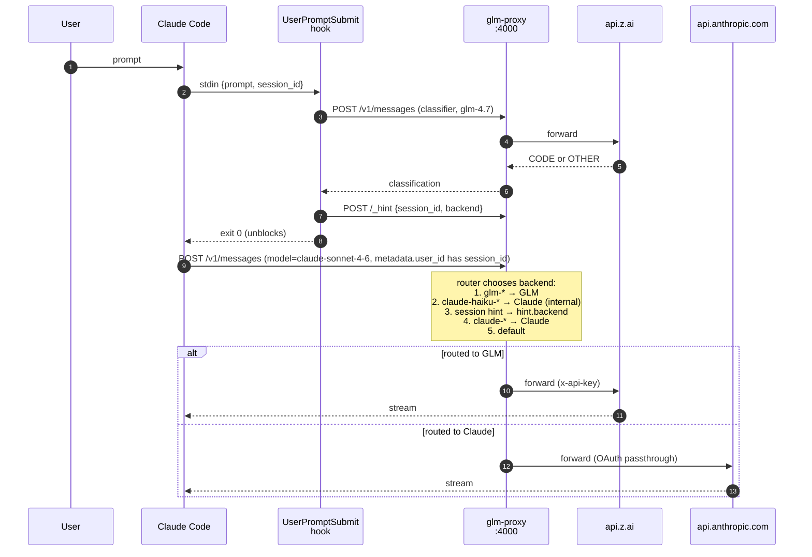

# glm-plugin-cc

Claude Code plugin + local proxy that auto-routes code-related prompts to [GLM (Z.ai)](https://z.ai) and everything else to Claude — within the same session, without manual model switching.

## How it works



Key properties:

- **Session-keyed hints** — multiple Claude Code sessions sharing one proxy don't cross-contaminate.
- **Internal haiku calls always go to Claude** so title/summary plumbing doesn't burn GLM quota.
- **Thinking blocks are stripped from history** before forwarding, so backends don't reject each other's signatures when the route switches mid-session.
- **`/model glm-5.1` or `/model opus`** always override the classifier.
- **Proxy auto-starts** on each Claude Code session via the `SessionStart` hook.

## Installation

```bash
claude plugin marketplace add pyy0715/glm-plugin-cc
claude plugin install glm@glm-plugin-cc
```

## Setup (one-time)

Inside Claude Code:

```
/glm:setup
```

The skill merges three keys into `~/.claude/settings.json` under `env`:

| Key | Purpose |
|-----|---------|
| `ANTHROPIC_BASE_URL=http://localhost:4000` | Routes all API calls through the proxy |
| `GLM_API_KEY=<your Z.ai key>` | Used by the proxy when forwarding to GLM |
| `GLM_PROXY_PATH=<absolute path>` | `SessionStart` hook uses this to spawn the proxy |

**After setup, `/exit` and `/resume` every running `claude` session.** Claude Code re-applies `ANTHROPIC_BASE_URL` to running sessions immediately, so any session that's open while you run `/glm:setup` will start getting `ECONNREFUSED` until the proxy is up. The restart triggers `SessionStart`, which spawns the proxy.

## Usage

After setup, just use Claude Code normally:

- Code-related prompts → classified as `CODE` → routed to GLM
- Everything else → classified as `OTHER` → routed to Claude
- `/model glm-5.1` → forces GLM for the session
- `/model opus` → forces Claude for the session

Routing decisions land in `/tmp/glm-proxy.log` (set `GLM_DEBUG=1` under `env` for extra detail).

## `/model` picker — register GLM

`ANTHROPIC_CUSTOM_MODEL_OPTION` only accepts one custom model. Add to `env`:

```json
{
  "env": {
    "ANTHROPIC_CUSTOM_MODEL_OPTION": "glm-5.1",
    "ANTHROPIC_CUSTOM_MODEL_OPTION_NAME": "GLM-5.1",
    "ANTHROPIC_CUSTOM_MODEL_OPTION_DESCRIPTION": "Z.ai GLM-5.1 (routed via glm-proxy)"
  }
}
```

Available GLM models (pass via `/model` or `ANTHROPIC_CUSTOM_MODEL_OPTION`): `glm-5.1`, `glm-5`, `glm-5-turbo`, `glm-4.7`, `glm-4.6`, `glm-4.5`, `glm-4.5-air`.

- GLM-5.1 / 5 / 5-Turbo: 3x quota peak, 2x off-peak
- GLM-4.7: 1x quota — used for the classifier (so classification doesn't eat your main budget)

## Statusline (optional)

Plugins can't auto-register a statusline. Add manually to `~/.claude/settings.json`:

```json
{
  "statusLine": {
    "type": "command",
    "command": "node ~/.claude/plugins/marketplaces/glm-plugin-cc/plugins/glm/scripts/statusline.js"
  }
}
```

Shows Claude 5-hour coding quota and GLM monthly MCP quota side-by-side.

## Troubleshooting

- **API errors in every open session right after `/glm:setup`** — Claude Code picked up the new `ANTHROPIC_BASE_URL` but the proxy isn't up yet. `/exit` and `/resume` each session; the first restart spawns the proxy.
- **`API error: 400 model: String should have at most 256 characters`** — you set `"model": "glm-..."` in settings.json but the proxy isn't running, so Claude Code is hitting `api.anthropic.com` directly. Either start the proxy or remove the `"model"` line to default back to Claude.
- **Port 4000 already in use** — set `PROXY_PORT=<other>` under `env`.
- **See routing decisions** — `GLM_DEBUG=1` under `env`. `GLM_HOOK_DEBUG=1` also enables `/tmp/glm-route-hook.log` with per-phase timing for the hook.
- **Cache feels stale after an update** — `ls ~/.claude/plugins/cache/glm-plugin-cc/glm/` and confirm the latest version directory matches `installed_plugins.json`. A `claude plugin update` only rebuilds the cache when the plugin's `version` string changes.

## Environment variables

| Variable | Default | Purpose |
|---|---|---|
| `ANTHROPIC_BASE_URL` | — | Set by `/glm:setup` to `http://localhost:4000` |
| `GLM_API_KEY` | — | Z.ai API key, used by the proxy |
| `GLM_PROXY_PATH` | — | Absolute path to `bin/glm-proxy.js`, used by `SessionStart` hook |
| `PROXY_PORT` | `4000` | Proxy listen port |
| `DEFAULT_BACKEND` | `claude` | Final fallback when no hint and no prefix matches |
| `GLM_PROXY_URL` | `http://localhost:4000` | Where the hook reaches the proxy |
| `GLM_CLASSIFY_TIMEOUT_MS` | `5000` | Classifier fetch timeout |
| `GLM_HINT_TTL_MS` | `60000` | How long a session hint stays valid |
| `GLM_PROXY_READY_TIMEOUT_MS` | `3000` | How long `SessionStart` polls for the proxy port |
| `GLM_PROXY_LOG` | `/tmp/glm-proxy.log` | Where the proxy's stdout/stderr go when spawned by the hook |
| `GLM_DEBUG` | unset | Proxy logs per-request metadata and thinking-strip events |
| `GLM_HOOK_DEBUG` | unset | `route-hook.js` writes phase timings to `/tmp/glm-route-hook.log` |

## Advanced

Run the proxy manually (for dev or debugging):

```bash
GLM_API_KEY=... node bin/glm-proxy.js
# or with debug logs:
GLM_DEBUG=1 GLM_API_KEY=... node bin/glm-proxy.js
```

For always-on (proxy runs even when `claude` isn't active): `launchd` / `systemd` templates are on the roadmap — see `docs/DECISIONS.md` Phase 4. Until then, the `SessionStart` hook covers the common case.

## Architecture and design decisions

- [`docs/DECISIONS.md`](docs/DECISIONS.md) — what we chose and why (proxy vs skill, routing priority, OAuth passthrough, litellm).
- [`docs/LEARNINGS.md`](docs/LEARNINGS.md) — empirically observed facts and pitfalls (plugin cache keying, `ANTHROPIC_BASE_URL` re-application, thinking-block signatures, orphan log inodes).
