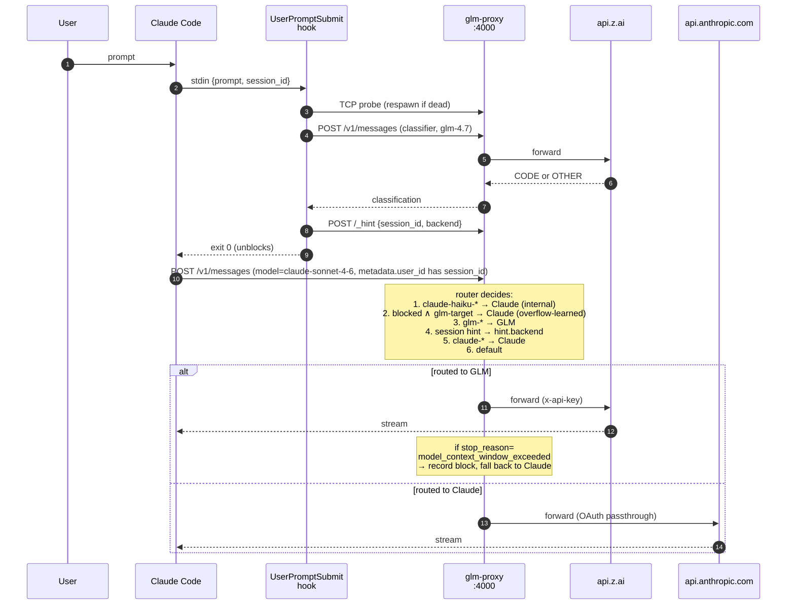

# glm-plugin-cc

Claude Code plugin + local proxy that auto-routes code-related prompts to [GLM (Z.ai)](https://z.ai) and everything else to Claude — within the same session, without manual model switching.

## Why this exists

I pay for both a Claude Pro/Max subscription (for planning, prose, conversation) and a Z.ai Coding Plan (for GLM-5.1, cheaper per-token on code). Before this plugin, using both meant `/model`-switching by hand on every turn, or giving up one in favor of the other.

Existing Claude Code proxies don't solve this well:

- Most are **format converters** (OpenAI/Gemini → Anthropic Messages). GLM already speaks the Anthropic format on Z.ai's Coding Plan endpoint, so the conversion layer is pure overhead.
- They route by **model name alone** (`/model glm-*` → GLM). The user still decides every turn.
- They route **every** Anthropic call through the alternate backend — including Claude Code's internal haiku plumbing (title generation, summaries), which silently burns your coding quota.
- Many depend on **litellm**, which had a credential-stealing supply-chain compromise on PyPI (2026-03-24, v1.82.8) and a trail of SSRF/RCE CVEs.
- **Third-party hosted proxies** share credentials across users, violating ToS and eating quota opaquely.

This plugin is built on a different premise: a **local proxy + Claude Code hook** pair that classifies each prompt's intent (`CODE` vs `OTHER`) *before* the request is sent, then routes by intent — not by model name. The proxy is zero-dependency Node.js, runs only on your machine, uses your own credentials, and leaves internal haiku calls on Claude.

## How it compares

| Project | Approach | Auto-classify intent | Session-isolated hints | Dependencies | Primary goal |
|---|---|---|---|---|---|
| **glm-plugin-cc** (this) | hook + local proxy | ✅ (glm-4.7 classifier) | ✅ per `session_id` | 0 | Run Claude Pro/Max and Z.ai side-by-side |
| [zai-org/zai-coding-plugins](https://github.com/zai-org/zai-coding-plugins) (official) | env vars only | ❌ | ❌ | 0 | Replace Claude with GLM as the whole backend |
| [starbaser/ccproxy](https://github.com/starbaser/ccproxy) | LiteLLM | ❌ (rule-based only) | ❌ | LiteLLM | Multi-LLM gateway |
| [1rgs/claude-code-proxy](https://github.com/1rgs/claude-code-proxy) | LiteLLM | ❌ | ❌ | LiteLLM | Use OpenAI/Gemini under CC |
| [fuergaosi233/claude-code-proxy](https://github.com/fuergaosi233/claude-code-proxy) | plain proxy | ❌ | ❌ | 0 | Format conversion |
| [Portkey-AI/gateway](https://github.com/Portkey-AI/gateway) | AI gateway | ❌ (metadata routing) | ❌ | gateway | Enterprise routing |
| [openai/codex-plugin-cc](https://github.com/openai/codex-plugin-cc) | CLI wrapper | — | — | Codex CLI | Delegate to Codex as a subagent |

Two axes where this plugin is uniquely positioned:

- **Auto-classify intent.** The classifier reads the user's prompt and picks a backend — `CODE` (produce/modify code) → GLM; `OTHER` (explain/chat/advise) → Claude. No `/model` dance.
- **Session-isolated hints.** Multiple Claude Code sessions sharing one proxy don't cross-contaminate. Each session's classifier verdict is keyed by the `session_id` the UserPromptSubmit hook sees.

## Key properties

- **Intent-based routing**, not model-name routing. Classifier runs as a cheap GLM-4.7 call (1x quota) inside the UserPromptSubmit hook.
- **Session-keyed hints** — multiple Claude Code sessions sharing one proxy stay isolated.
- **Internal haiku calls always go to Claude** so Claude Code's title/summary plumbing doesn't burn GLM quota.
- **Thinking blocks stripped from history** before forwarding, so backends don't reject each other's signatures when the route switches mid-session.
- **Context-overflow aware** — when GLM rejects a turn with `model_context_window_exceeded` (common on `claude-opus-4-6[1m]` sessions whose context grows past GLM's 200K limit), the proxy records the session and preempts subsequent GLM-bound turns to Claude for 10 minutes. Earlier turns still go to GLM; only the overflowing session is skipped.
- **Proxy auto-recovery** — if the proxy crashes or is killed mid-session, the next prompt's hook respawns it automatically. Dead state is also surfaced in the statusline as `proxy down` in bold red.
- **`/model glm-5.1` or `/model opus`** always override the classifier.
- **OAuth token passthrough** — Claude-routed requests reuse your Claude Code OAuth header unchanged. GLM-routed requests swap it for `x-api-key: $GLM_API_KEY`.
- **Zero runtime dependencies** — plain Node.js stdlib (`http`, `net`, `child_process`). No LiteLLM.

## Limitations / what this is not

- **macOS/Linux verified; Windows untested.** Node.js itself is portable, but `spawn + detached + unref` and the SessionStart hook flow haven't been exercised on Windows.
- **Z.ai Coding Plan only.** The Standard GLM API (`api/paas/v4`) returns 429 on the Coding Plan — this plugin targets `https://api.z.ai/api/anthropic/v1/messages` specifically.
- **Depends on Anthropic OAuth token shape.** Claude Code's auth header format can change; the proxy just passes it through, but if the shape changes dramatically we'd need to adapt.
- **First context-overflow turn per session is unavoidable.** The reactive block learns from GLM's actual rejection — the first overflowing turn still makes one wasted GLM call before the proxy knows to skip it. Every subsequent turn in that session is saved.
- **Relies on Claude Code internals that aren't public API.** `body.metadata.user_id` stringified JSON, the `[1m]` suffix that signals 1M context, internal `claude-haiku-*` for plumbing. Confirmed empirically (and via the `ultraworkers/claw-code` leak); may drift across Claude Code releases.
- **Hook race on proxy respawn.** If the proxy is dead *and* Claude Code exhibits the UserPromptSubmit blocking anomaly (see `docs/LEARNINGS.md` §3.2), the respawn may complete after the main API request has already fired — that one turn still 502s, next turn recovers. Statusline shows the state.
- **Local-only, single-user.** No remote/team proxy, no shared-credential scheme. By design (ToS, privacy).
- **No automatic Windows/WSL path resolution** in `/glm:setup`. If you're on a non-standard install, you'll be asked for `GLM_PROXY_PATH` manually.

## How it works



## Installation

```bash
claude plugin marketplace add pyy0715/glm-plugin-cc
claude plugin install glm@glm-plugin-cc
```

## Setup (one-time)

Inside Claude Code:

```
/glm:setup
```

The skill merges three keys into `~/.claude/settings.json` under `env`:

| Key | Purpose |
|-----|---------|
| `ANTHROPIC_BASE_URL=http://localhost:4000` | Routes all API calls through the proxy |
| `GLM_API_KEY=<your Z.ai key>` | Used by the proxy when forwarding to GLM |
| `GLM_PROXY_PATH=<absolute path>` | `SessionStart` hook uses this to spawn the proxy |

**After setup, `/exit` and `/resume` every running `claude` session.** Claude Code re-applies `ANTHROPIC_BASE_URL` to running sessions immediately, so any session that's open while you run `/glm:setup` will start getting `ECONNREFUSED` until the proxy is up. The restart triggers `SessionStart`, which spawns the proxy.

## Usage

After setup, just use Claude Code normally:

- Code-related prompts → classified as `CODE` → routed to GLM
- Everything else → classified as `OTHER` → routed to Claude
- `/model glm-5.1` → forces GLM for the session
- `/model opus` → forces Claude for the session

Routing decisions land in `/tmp/glm-proxy.log` (set `GLM_DEBUG=1` under `env` for extra detail).

## `/model` picker — register GLM

`ANTHROPIC_CUSTOM_MODEL_OPTION` only accepts one custom model. Add to `env`:

```json
{
  "env": {
    "ANTHROPIC_CUSTOM_MODEL_OPTION": "glm-5.1",
    "ANTHROPIC_CUSTOM_MODEL_OPTION_NAME": "GLM-5.1",
    "ANTHROPIC_CUSTOM_MODEL_OPTION_DESCRIPTION": "Z.ai GLM-5.1 (routed via glm-proxy)"
  }
}
```

Available GLM models (pass via `/model` or `ANTHROPIC_CUSTOM_MODEL_OPTION`): `glm-5.1`, `glm-5`, `glm-5-turbo`, `glm-4.7`, `glm-4.6`, `glm-4.5`, `glm-4.5-air`.

- GLM-5.1 / 5 / 5-Turbo: 3x quota peak, 2x off-peak
- GLM-4.7: 1x quota — used for the classifier (so classification doesn't eat your main budget)

## Statusline (optional)

Plugins can't auto-register a statusline. Add manually to `~/.claude/settings.json`:

```json
{
  "statusLine": {
    "type": "command",
    "command": "node ~/.claude/plugins/marketplaces/glm-plugin-cc/plugins/glm/scripts/statusline.js"
  }
}
```

Shows Claude 5-hour coding quota and GLM coding quota side-by-side. When the local proxy is unreachable, `proxy down` appears in bold red at the tail of the line.

## Troubleshooting

- **API errors in every open session right after `/glm:setup`** — Claude Code picked up the new `ANTHROPIC_BASE_URL` but the proxy isn't up yet. `/exit` and `/resume` each session; the first restart spawns the proxy. (As of 0.4.2 the next *prompt* also respawns it automatically via the UserPromptSubmit hook.)
- **`API error: 400 model: String should have at most 256 characters`** — you set `"model": "glm-..."` in settings.json but the proxy isn't running, so Claude Code is hitting `api.anthropic.com` directly. Either start the proxy or remove the `"model"` line to default back to Claude.
- **Port 4000 already in use** — set `PROXY_PORT=<other>` under `env`.
- **`proxy down` keeps appearing in the statusline** — check `lsof -ti:4000`, `ps -ef | grep glm-proxy`, and `/tmp/glm-proxy.log` in that order. `GLM_HOOK_DEBUG=1` writes per-phase timing to `/tmp/glm-route-hook.log`.
- **See routing decisions** — `GLM_DEBUG=1` under `env`.
- **Cache feels stale after an update** — `ls ~/.claude/plugins/cache/glm-plugin-cc/glm/` and confirm the latest version directory matches `installed_plugins.json`. A `claude plugin update` only rebuilds the cache when the plugin's `version` string changes.

## Environment variables

| Variable | Default | Purpose |
|---|---|---|
| `ANTHROPIC_BASE_URL` | — | Set by `/glm:setup` to `http://localhost:4000` |
| `GLM_API_KEY` | — | Z.ai API key, used by the proxy |
| `GLM_PROXY_PATH` | — | Absolute path to `bin/glm-proxy.js`, used by both the `SessionStart` and `UserPromptSubmit` hooks |
| `PROXY_PORT` | `4000` | Proxy listen port |
| `DEFAULT_BACKEND` | `claude` | Final fallback when no hint and no prefix matches |
| `GLM_ROUTED_MODEL` | `glm-5.1` | Model the proxy substitutes when routing to GLM with a non-`glm-*` request (i.e. classifier-driven routing of `claude-sonnet-*` / `claude-opus-*`). Set to `glm-4.7` for cheaper auto-routing. |
| `GLM_PROXY_URL` | `http://localhost:4000` | Where the hook reaches the proxy |
| `GLM_CLASSIFY_TIMEOUT_MS` | `5000` | Classifier fetch timeout |
| `GLM_HINT_TTL_MS` | `60000` | How long a session hint stays valid |
| `GLM_PROXY_READY_TIMEOUT_MS` | `3000` | How long the hooks poll for the proxy port after spawning |
| `GLM_BLOCK_TTL_MS` | `600000` | How long a session stays blocked from GLM after a context-window overflow |
| `GLM_PROXY_LOG` | `/tmp/glm-proxy.log` | Where the proxy's stdout/stderr go when spawned by the hook |
| `GLM_DEBUG` | unset | Proxy logs per-request metadata and thinking-strip events |
| `GLM_HOOK_DEBUG` | unset | `route-hook.js` writes phase timings to `/tmp/glm-route-hook.log` |

## Advanced

Run the proxy manually (for dev or debugging):

```bash
GLM_API_KEY=... node bin/glm-proxy.js
# or with debug logs:
GLM_DEBUG=1 GLM_API_KEY=... node bin/glm-proxy.js
```

The proxy process stays up until you reboot or kill it, so after the first `claude` session spawns it via `SessionStart`, subsequent sessions reuse it. No separate daemon setup is needed.

## Architecture and design decisions

- [`docs/DECISIONS.md`](docs/DECISIONS.md) — what I chose and why (proxy vs skill, routing priority, OAuth passthrough, litellm-avoidance, reactive session block). Currently in Korean.
- [`docs/LEARNINGS.md`](docs/LEARNINGS.md) — empirically observed facts and pitfalls (plugin cache keying, `ANTHROPIC_BASE_URL` re-application, thinking-block signatures, Z.ai's `200 OK + stop_reason` overflow signaling, orphan log inodes). Currently in Korean.
